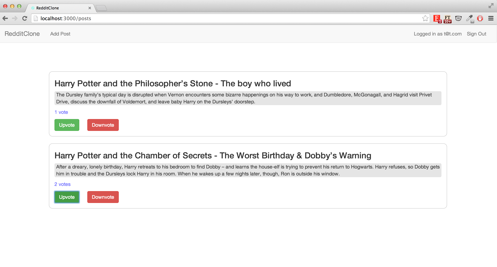

## Reddit Clone

Week 10 project to create a Reddit-like web application at [Makers Academy](http://www.makersacademy.com).
On top of being able to sign in and add posts, the goal of this project was to replicate the upvoting and downvoting functionalities that Reddit has.

The vote calculation on this app is made to be time-sensitive such that only votes from the last week would be displayed.

An added feature was a mailboxer functionality whereby users get an email notification whenever their posts have a change in votes.

This task was set by [Alex Peattie](https://github.com/alexpeattie)

##

### Home page with posts and votes

##Stack:

- Ruby
- Ruby on Rails
- Javascript
- JSON
- Coffeescript
- Launchy
- Bootstrap SCSS
- Websocket Rails

For Testing:
- Capybara
- Rspec
- Factory Girl
- Timecop
- Capybara Mailer
- Mailcatcher
- Poltergeist
- Database Cleaner

##Contributers:

- [Tiffanie Chia](https://github.com/tiffaniechia)
- [Andrew Cumine](https://github.com/ajcumine)
